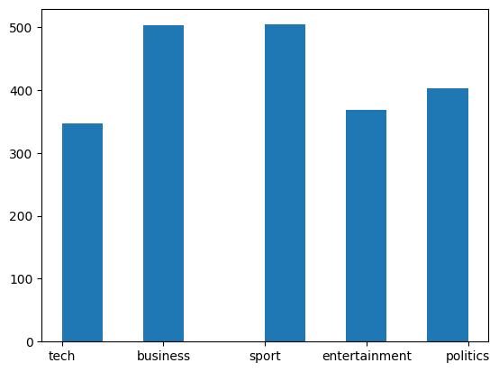
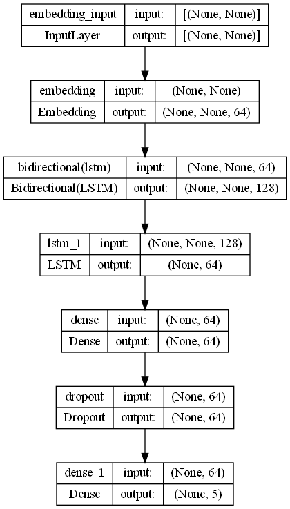
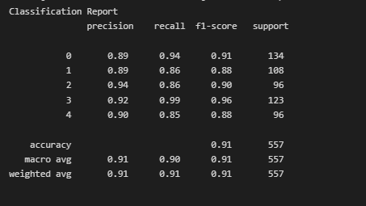
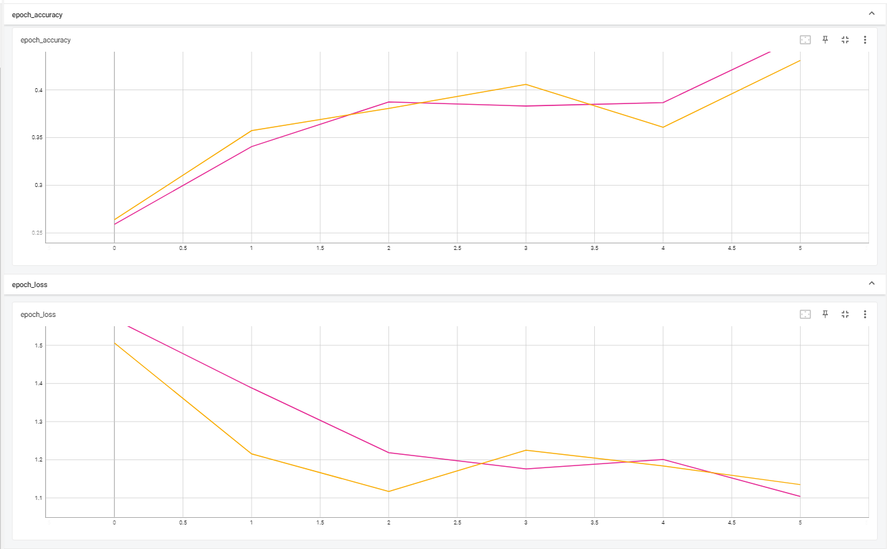

# Deep Learning Model for Categorizing Unseen Articles into Sport, Tech, Business, Entertainment, and Politics

## Project description

Text documents are essential as they are one of the richest sources of data for businesses. Text documents often contain crucial information which might shape the market trends or influence the investment flows. Therefore, companies often hire analysts to monitor the trend via articles posted online, tweets on social media platforms such as Twitter or articles from newspaper. However, some companies may wish to only focus on articles related to technologies and politics. Thus, filtering of the articles into different categories is required. Often the categorization of the articles is conduced manually and retrospectively; thus, causing the waste of time and resources due to this arduous task. Hence, your job as a machine learning engineer is tasked to categorize unseen articles into 5 categories namely Sport, Tech, Business, Entertainment and Politics.

These are steps used to complete this project.

#### 1. Import Necesary Modules

#### 2. Data Loading
    - Loaded csv dataset by using pandas load_csv()
    
#### 3. Data Inspection
    - Inspected the text data for the info, duplicates and missing data. 

    

#### 4. Data Cleaning
    - Used NLTK to remove stopwords,
    - Lemmatization to convert words to its base word, and
    - Regex to remove unwanted characters
    
#### 5. Data Preprocessing
    - Used Tokenizer and Pad_sequences to normalize features
    - The target was normalized by using One Hot Encoding
    
#### 6. Model Development
    - Created a model using Tensorflow Bidirectional Long Short-Term Memory (LSTM) with 64 nodes for every layer with Dropout and 25 epochs.
    (*Do increase the nodes, layers and epoch for better results)
    - Used callbacks(ie. TensorBoard and Early Stopping) to prevent overfitting.

#### 7. Model Evaluation
    - Evaluated the model by using Classification Report.
    
#### 8. Save the Model
    -  Saved the model
 
## Results

    - The Classification Report showed an accuracy of around 91% with an a range of F1 score between 0.88 to 0.96. This model did an okay job of classifiying texts.   

    - Tensorboard graph showed a little overfitting

## Acknowledgement
The dataset used for this project is by *[Susan Li](https://github.com/susanli2016/PyCon-Canada-2019-NLP-Tutorial/blob/master/bbc-text.csv)*
